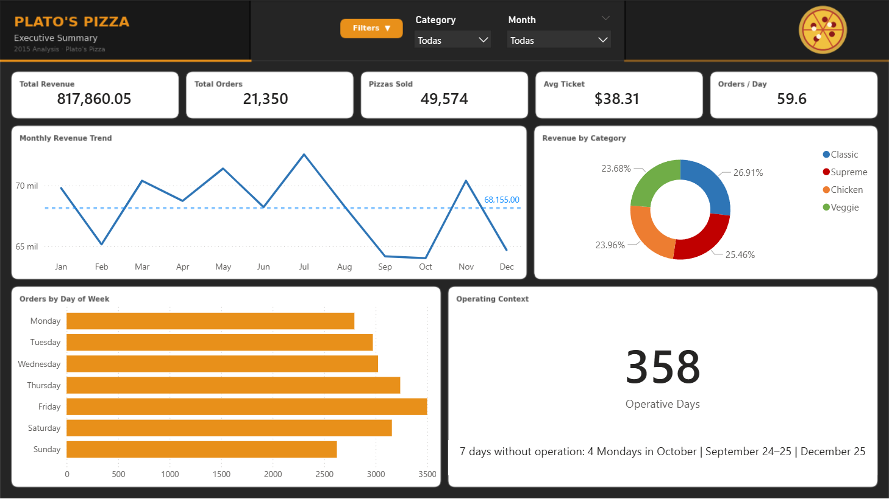
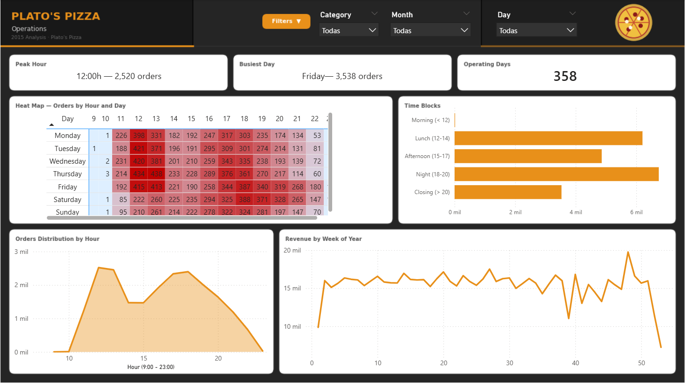
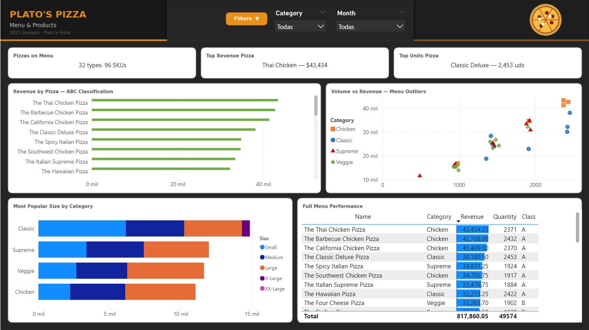

# Plato's Pizza — Sales Analysis 2015

End-to-end data analytics project using the [Pizza Place Sales dataset](https://www.mavenanalytics.io/data-playground) from Maven Analytics. One full year of transactions (2015) analyzed to help the restaurant owner make smarter decisions about staffing, menu, and operations.

---

## Business Problem

> *"I want to optimize our operations and menu for next year: identify which pizzas to promote, when we need more staff, and whether there are products we should drop."*

**Stakeholder:** Restaurant owner / general manager  
**Dataset:** 21,350 orders · 49,574 pizzas sold · $817,860 in revenue · 358 operating days

---

## Key Findings

| # | Insight | Action |
|---|---------|--------|
| 1 | **Fridays drive 34% more orders than Sundays** | Staff up on Fridays — equal staffing all week is inefficient |
| 2 | **Peak hours: 12:00h and 18:00–19:00h** | Prep windows at 10–11h and 16–17h before each rush |
| 3 | **Thai Chicken, BBQ Chicken & California top revenue** | Promote high-value Chicken pizzas to lift average ticket |
| 4 | **Brie Carre ranks last** | Only available in size S, 490 units sold — candidate for removal |
| 5 | **October looks slow — but it's a calendar issue** | 4 Mondays closed that month; normalized revenue is in line with the rest |

---

## Dashboard

Built in Power BI — 3 pages, one per audience.

### Page 1 — Executive Summary


### Page 2 — Operations


### Page 3 — Menu & Products


---

## Project Structure

```
/data/raw/          ← original CSVs (never modified)
/data/clean/        ← cleaned dataset + aggregation tables
/notebooks/         ← Jupyter notebooks, one per phase
/powerbi/           ← Power BI dashboard (.pbix)
/visuals/           ← dashboard screenshots
analysis_decisions.md  ← analytical decision log per phase
data_dictionary.csv    ← field-level metadata for all tables
```

---

## Tech Stack

- **Python** — Pandas, Matplotlib, Seaborn (Jupyter Notebooks)
- **Power BI** — interactive dashboard with DAX measures
- **Git / GitHub** — version control

---

## How to Run

1. Clone the repository
2. Open any notebook in `/notebooks/` with Jupyter (Anaconda recommended)
3. Run cells top to bottom — each notebook reads from `data/clean/` and outputs to the same folder
4. Open `powerbi/Dashboard_Pizzeria 2.0.pbix` in Power BI Desktop

---

## Author

**Eugenio Quintero** — Data Analyst  
[GitHub](https://github.com/EugenioQs) · [LinkedIn](https://www.linkedin.com/in/eugenioqs/)
